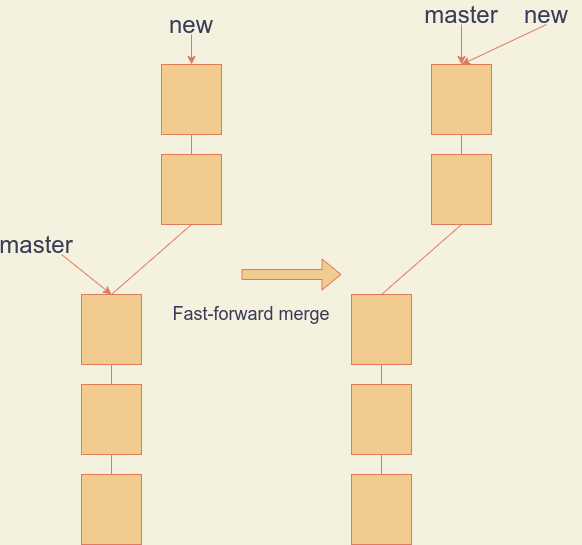
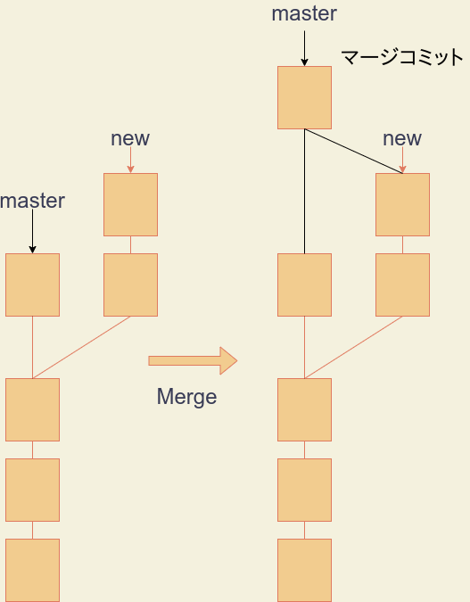
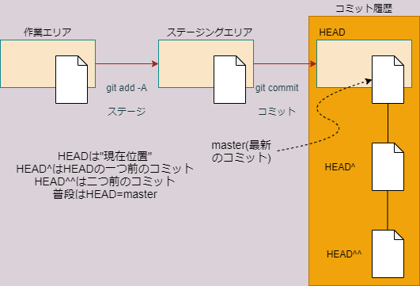

# Gitの練習

- [Gitの練習](#gitの練習)
  - [このリポジトリについて](#このリポジトリについて)
  - [git logの使い方](#git-logの使い方)
  - [過去のバージョンを閲覧する](#過去のバージョンを閲覧する)
  - [ブランチを作る](#ブランチを作る)
  - [ブランチをマージする](#ブランチをマージする)
  - [過去のコミットを打ち消す](#過去のコミットを打ち消す)
  - [過去のコミットを無かったことにする](#過去のコミットを無かったことにする)
  - [コマンドエイリアスを作る](#コマンドエイリアスを作る)
  - [.gitignoreファイル](#gitignoreファイル)
  - [ファイル削除のステージング](#ファイル削除のステージング)
  - [ファイル名変更のステージング](#ファイル名変更のステージング)
  - [変更のスタッシュ](#変更のスタッシュ)
  - [リモートリポジトリの作成](#リモートリポジトリの作成)
  - [新規ブランチのプッシュ](#新規ブランチのプッシュ)
  - [リモートブランチの削除](#リモートブランチの削除)
  - [ホームページを作る](#ホームページを作る)

## このリポジトリについて

これはKUT経・マネの講義「プログラミング」においてGitの使い方を練習するためのリポジトリです。

## git logの使い方

このリポジトリをクローンしたら、作業ディレクトリで右クリック、`Git bash here`して`bash`コンソールを立ち上げてください。

次のコマンドにより、このリポジトリの履歴を閲覧することができます。

```bash
git log
```

結果はたとえば次のようになります。

```git
commit 1c75357290ce957a2a90cf4040ed9d1de15a0459 (HEAD -> master, origin/master, origin/HEAD)
Author: Yutaka Kobayashi <48763691+kobayashiyutaka@users.noreply.github.com>
Date:   Tue Jun 8 00:00:08 2021 +0900

    Update README.md

    modify the output of git log

commit a1bf77a96495cc2b67445c4035a48aec93b53f9d
Author: Yutaka Kobayashi <48763691+kobayashiyutaka@users.noreply.github.com>
Date:   Mon Jun 7 23:48:49 2021 +0900

    Update README.md

    add the result of git log

commit 35d634694cdc17437b5fb3d73ce69b2483d136c4
Author: Yutaka Kobayashi <48763691+kobayashiyutaka@users.noreply.github.com>
Date:   Mon Jun 7 23:34:13 2021 +0900

    Update README.md

    add explanation about git log --oneline

```

ここで、これまでにこのリポジトリになされたコミットが表示されており、一番上が最新のコミットになります。`commit`の右隣に表示されている長い16進数の数字は、SHA1-ID(シャーワンID)といって、コミットのハッシュ値です(ハッシュに関しては、後の講義で取り上げます。)SHAは[セキュア・ハッシュ・アルゴリズム](https://ja.wikipedia.org/wiki/SHA-1)の訳です。

なお、`git log`の出力は、`less`という名前の**ページャー**プログラムに自動的に**パイプ**されています。Linuxの用語なので分かりにくいと思いますが、`less`というプログラムはファイルの内容を閲覧するLinuxの標準的なプログラムです。`git`は、`log`の出力を`less`に送り込みます。

`less`の画面では、`j`を押すと下に進み、`k`を押すと上に戻ります。`q`でプログラムを終了することができます。

各コミットを一行に表示したければ、次のようにします。

```bash
git log --oneline
```

```git
1c75357 (HEAD -> master, origin/master, origin/HEAD) Update README.md
a1bf77a Update README.md
35d6346 Update README.md
ee93b29 Update README.md
543e0ad Initial commit
```

この場合、メッセージは、最初の一行だけが表示されます。

## 過去のバージョンを閲覧する

過去にコミットされたバージョンを閲覧したいときは、次のように、望みのコミットを`checkout`します。

```bash
git checkout 35d6
```

`checkout`の引数には、SHA1-IDの最初の数桁を渡します。たとえば、上記の`35d6`は、このリポジトリの3つめのコミットですので、かなり初期のバージョンになります。

チェックアウトすると、作業ディレクトリの中身がコミット35d6346...時点のものになります。`README.md`の内容がかなりスカスカになったことを確認してください。コミット`35d6`の時点では、まだこれだけしかREADME.mdを編集していなかったということです。

この状態で`git log master`すると、`HEAD`が`master`とずれているのが分かると思います。`HEAD`があるのが現在閲覧しているコミットで、`master`が最新のコミットです。

最新のコミットまで戻ってくるには、次のようにして`master`を`checkout`します。

```bash
git checkout master
```

## ブランチを作る

**注)ここからの作業は慎重に!**

それでは、最新のコミットから、別のバージョンを作ってみましょう。別バージョンのことをGitでは**ブランチ**と言います。ここでは新規ブランチの名前はnewにします。

```bash
git branch new
```

ブランチを切り替えるには、`new`を`checkout`します。

```bash
git checkout new
```

現在`new`ブランチにいることを、確かめるには、`git branch`します。

```bash
$ git branch
  master
* new
```

アスタリスクがついているのが現在いるブランチです。

なお、ブランチの作成と同時に作成したブランチをチェックアウトするには、次のようにします。

```bash
git checkout -b new
```

それでは、このバージョンに、新たなファイルを付け足してみましょう。作業ディレクトリの中に`new_code.py`という名前のファイルを作って、適当にPythonコードを書き込んで見てください。

適当にPythonコードを編集しながら、2～3回コミットしてください。

さて、この状態で`git log --oneline`して見てください。

```git
b673206 (HEAD -> new) Update new_code.py
ad627f4 Update README.md slightly
a69eb64 Add new_code.py and update README.me accordingly
1c75357 (origin/master, origin/HEAD, master) Update README.md
a1bf77a Update README.md
35d6346 Update README.md
ee93b29 Update README.md
543e0ad Initial commit
```

以前のブランチ`master`よりも`new`が先に進んでいることが分かると思います。

## ブランチをマージする

新しいブランチの内容に満足して、これをメイン・バージョンにしたいときは、もとのブランチに合流させます。これによって、ブランチ`new`で試していた変更が全て`master`に反映されます。

まずは、本流のブランチ`master`を`checkout`します。

```bash
git checkout master
```

`git branch`で、ちゃんと`master`に戻ったことを確認してください。

```bash
$ git branch
* master
  test
```

次のコマンドで、`new`ブランチを`master`にマージさせます。

```bash
git merge new
```

これで、`new`の変更が全て`master`に反映されました。

実際には、ここで行った`merge`は**fast-forward merge**という特別なマージです。このマージは、`new`が分岐してから`master`の方に全く変更がなかった場合に起きるマージで、単に`master`を`new`の先頭に移動させます。追加のコミットは発生しません。



より一般には、分岐後に`new`と`master`の両方に変更がある状態がお消えます。この場合、マージ過程は下図のようになり、マージはコミットとして履歴に残ります。



こうしたマージは場合によって複雑になりえますので、本講義では解説を省略します。個人で開発する分には、複数バージョンを同時開発するのでないかぎり、fast-forward mergeで事足りると思います。

ブランチ`new`を`master`にマージしたら、`new`はもう必要ありませんので、次のようにして削除しておいてください。

```bash
git branch -d new
```

## 過去のコミットを打ち消す

Gitでは、過去のコミットを打ち消すコミットをすることができます。これを`revert`といいます。

```bash
git revert ****
```

ここで`****`は打ち消したいコミットのSHA1-IDです。最新のコミットを`revert`したいならば、SHA1-IDの代わりに`HEAD`を指定できます。

```bash
git revert HEAD
```

これを試してみましょう。

先ほど作った`new_code.py`のコードの数行を削除してみてください。そのうえで、変更をコミットしましょう。

変更がコミットできたら、今行ったコミットを`revert`で打ち消してみます。`git log`で履歴の状況を確認してから、上記のように`git revert HEAD`してみてください。

`revert`はあくまで打ち消しコミットなので、メッセージの入力を求められますが、デフォルトのままで良いでしょう。

`revert`ができたら、削除した行が復活するはずです。

## 過去のコミットを無かったことにする

過去のコミットを無かったことにしてある状態までもとに戻すことを`reset`と言います。`reset`には3種類あります。**Gitの理解は、この3種類のresetの違いが理解できているかどうかにかかっています。**

|resetのオプション|機能|
|--|--|
|`--hard`|作業ディレクトリもステージングエリアも両方戻す|
|`--soft`|履歴だけ戻す|
|`--mixed`|履歴とステージングエリアだけ戻す|

引数には、どこまでもとに戻したいかを指定します。なおオプション・引数無しの`git reset`はステージングの取り消しを意味します。



たとえば、最新のコミットだけ取り消したい場合は、

```bash
git reset --soft HEAD^
```

のようにオプションを`--soft`にして、引数に`HEAD^`を指定します(**まだリセットしないでください!**)。`HEAD^`は、`HEAD`位置よりも一つ前、という意味です。


最新と一つまえのコミットを取り消す場合は、

```bash
git reset --soft HEAD^^
```

とします。`HEAD^^`は、`HEAD`より二つまえという意味です。

`revert`が打ち消したいコミットを指定するのに対し、`reset`は取り戻したいコミットを指定することに注意してください。

`--soft`オプションでは、変更はステージングするまえの状態になります。コミット履歴と一緒にステージングエリアももとに戻してしまいたいときは、オプションを`--mixed`にします。


作業ディレクトリもステージングエリアも元に戻す、つまり何もかもなかったことにするには、`--hard`を指定します。


それではコミット履歴だけもとに戻すソフトリセットをしてみましょう。

`new_code.py`の行を数行削除してコミットしてください。コミットしたら、`git log`で状態を確認しておいてください。

次に、一つ前のコミットにリセットしてみましょう。

```bash
git reset --soft HEAD^
```

削除した行が戻るはずです。`git log`でコミット履歴の状態を調べておいてください。`master`と`HEAD`が共に一つまえのコミットに戻っているはずです。

次に`git status`をして、ステージングエリアの状況を調べてください。コミットする前の変更がステージされているはずです。これを再コミットしても良いですが、作業エリアもステージングエリアも綺麗に元通りにしておくことにします。

そのためには、現在の`HEAD`の位置にステージングエリアも作業エリアも合わせればよいので、次のようにします。

```bash
git reset --hard HEAD
```

## コマンドエイリアスを作る

`git log`には`--oneline`などの便利なオプションがたくさんあります。たとえば、次のように入力してみてください。

```bash
git log --graph --oneline --all --abbrev-commit
```

各オプションには次のような意味があります。

|オプション|意味|
|--|--|
|`--graph`|ブランチの関係を線で表示|
|`--oneline`|1行表示|
|`--all`|全てのブランチを表示|
|`--abbrev-commit`|コミットIDを短縮表示|

いちいちこういったオプションを打ち込むのは面倒です。そういうときは、コマンドにエイリアスを作ることができます。

ここでは、`git`ユーザーに一般的に使われているエイリアスである`lol`を定義してしまいましょう。`bash`で次のように入力します。

```bash
git config --global alias.lol "log --graph --oneline --all --abbrev-commit"
```

次のようにして`lol`が定義されたかチェックしてください。

```bash
git lol
```

## .gitignoreファイル

通常、作業エリアにおいたファイルは、全てgitのリポジトリにより、「追跡されていない新規ファイル」として認識されてしまいます。従って、`git add -A`すると、必ず追跡されてしまいます。

リポジトリの中にあるファイルがリポジトリから無視され、追跡されないようにするには、作業ディレクトリの中に、`.gitignore`というファイルを作成し、その中に、無視するファイル名の一覧を記入します。

たとえば、`.vscode`というディレクトリ、`code`というディレクトリをまるごと無視してほしい、`sample-`で始まる名前のファイルを全て無視してほしい、という場合は、次のように記入します。

```git
.vscode/
code/
sample-*
```

それでは、`local-memo.md`というファイルを作成したうえで、`git status`してください。次のように表示され、リポジトリに検知されていることが分かります。

```git
ブランチ master
Your branch is up to date with 'origin/master'.

追跡されていないファイル:
  (use "git add <file>..." to include in what will be committed)

local_memo.md

nothing added to commit but untracked files present (use "git add" to track)
```

それでは、VS Codeで.gitignoreというファイルを作り、以下のように記述してください。

```git
local-*
```

これで、`local-memo.md`は検知されなくなったはずです(`git status`してみてください)。

しかし、この方法では、`.gitignore`自体は検知されますので、これも無視してほしいときは、

```git
local-*
.gitignore
```

のように、自分自身のファイル名を`.gitignore`に記述しておきます。

## ファイル削除のステージング

次に、リポジトリからファイルを削除する方法について考えます。まずは、空のファイル`test`を作ってコミットしてください。空のファイルを作るには、`touch`コマンドが使えます。`bash`コンソール上で、次のようにしてください。

```bash
touch test
```

`git status`して新しいファイルが検知されていることをチェックし、コミットしてリポジトリに追加してください。

次に、リポジトリの中のファイルをリストアップしてみましょう。次のコマンドを使います。

```bash
$ git ls-files
README.md
new_code.py
test
```

表示される一覧に`test`があれば、ファイルがリポジトリに追加されています。なお、作業エリア内のファイルをリストアップするには、単に

```bash
$ ls
README.md  local-memo.md  new_code.py  test
```

と入力します。

作業エリアからファイルを削除しても、リポジトリからは削除されません。リポジトリと作業エリアの両方からファイル`test`を削除するには、次のようにします。

```bash
git rm test
```

これにより、『`test`の削除』という変更がステージングされますので、`git status`して確認してください。最終的に、この変更をコミットすれば、`test`がリポジトリから削除されます。`git ls-files`して確かめてみてください。

## ファイル名変更のステージング

もう一度空のファイル`test`を作ってコミットしてみてください。今度はこのファイルの名前を変更してみます。

作業ディレクトリのファイル名を変更すると、そのファイルは新しいファイルと認識されてしまいます。これを避けるためには、リポジトリ内のファイルと作業エリアのファイルの両方を同時に変更する必要があります。

たとえば、`test`を`test2`に変更する場合は、次のようにします。

```bash
git mv test test2
```

`git ls-files`および`ls`で、作業エリアとリポジトリの両方のファイル名が変更されたことを確認してください。

## 変更のスタッシュ

コミットしていない変更がある場合は、他のブランチや過去のコミットをチェックアウトすることはできません。しかし、変更をまだコミットしたくない場合もあります。そういう場合は、変更を**スタッシュ**します。スタッシュとは、変更を一時的に隠しておく、ということを意味します。

`new_code.py`に適当な1行を付け足してください。それを**コミットせずに**、過去のバージョンをチェックアウトしてみてください。次のようなエラーが出るはずです。

```git
error: Your local changes to the following files would be overwritten by checkout:
new_code.py
Please commit your changes or stash them before you switch branches.
Aborting
```

このような場合、次のようにして変更を`stash`します。

```bash
git stash
```

`new_code.py`につけくわえた1行が消えるはずです。これでチェックアウトできるようになるはずですので、試して見てください。

スタッシュした変更を元に戻すためには、次のようにして`pop`します。

```bash
git stash pop
```

先程付け加えた1行は削除しておくことにしましょう。

## リモートリポジトリの作成

ここではリモートに、課題リポジトリではなく自分だけの独自のリポジトリを作成してローカルにクローンしてみましょう。

[GitHub](https://github.com/)のサイトにアクセスし、右上のユーザーアイコンから、`Your repositories`を選択してください。

画面が切り替わったら、`New`という緑色のボタンがページ中程にありますので、こちらをクリックしてください。作成するリポジトリの設定を入力する画面になります。各項目を、以下のように設定してください。

- `Repository name`にリポジトリの名前を入力します。ここでは、`first-repo`にしておきましょう。
- `Public`と`Private`を選択できますが、`Private`にしてください。
- `Initialize this repository with:`の欄は、`Add a README file`だけチェックします。

以上のように設定できたら、`Create rpository`をクリックしてリポジトリを作成しましょう。

リポジトリが作成できたら、いつもの要領でローカルのGitHubディレクトリの下にクローンしてください。

## 新規ブランチのプッシュ

ローカルで新規ブランチを作っただけでは、リモートには反映されません。ここでは、ローカルで新しく作ったブランチをリモートにプッシュして、リモートにも新しいブランチを作りましょう。

まず、先程クローンしたリポジトリの`README.md`を次のように編集してコミットし、リモートにプッシュしてください。

```markdown
# first-repo

この文章はmasterで追加しました。
```

GitHubのサイトで、リモートリポジトリに編集が加わったことを確認してください。

次に、新規ブランチ`new`を作成してチェックアウトし、`README.md`に以下のように1行付け加えてブランチ`new`にコミットしてください(練習です)。

```markdown
# first-repo

この文章はmasterで追加しました。

この文章はnewで追加しました。
```

この状態で`git log`して、 `HEAD`がブランチ`new`を指していることを確認しましょう。GitHubのリモートリポジトリの状況を確認し、まだ`1 branch`となっていて、`master`のみが存在することに注意してください。

また、`new`をチェックアウトした状態で次のように入力して、`new`の上流ブランチが未設定であることを確認してください。

```bash
git status -sb
```

このブランチをリモートにプッシュするには、`branch --set-upstream-to`で上流ブランチを`origin/new`に設定します。

```bash
git branch --set-upstream-to=origin/new
```

これで`push`すれば、リモートにも`new`が作られます。GitHubのサイトで、`2 branches`という表示が現れていることを確認してください。

## リモートブランチの削除

ローカルブランチを削除しても、リモートブランチは削除されません。リモートブランチを削除するには、ローカルブランチを削除したあと、『ブランチの削除』をプッシュする必要があります。

まずローカルでブランチ`new`をブランチ`master`にマージしてください。マージできたら、`master`をリモートにプッシュし、ローカルの`new`を削除してください(練習です)。

このあと、リモートのブランチ`new`を削除するには、次のようにします。

```bash
git push origin :new
```

GitHubのサイトで、ブランチ`new`が削除されて`master`だけになったことを確認してください。

## ホームページを作る

GitHubのパブリックリポジトリは、ちょっとした設定でそのままホームページになります。訳あってホームページを作りたいが、

- HTMLを書くのは面倒くさい
- 凝ったデザインは必要ない(作りたくない)
- ただで作りたい

という人は、マークダウンでHPを書いていつでもどこでも`fetch`と`pull`でダウンロードしてきて`push`で更新できるGitHubリポジトリが便利です。Draw.io Integrationと合わせると、図の作成もVS Codeで完結できます。

GitHubのサイトで、先に説明した要領で、`sample-page`というリポジトリを作ってください(README.mdにチェックを入れるのを忘れないように)。ただし、今度は`public`リポジトリにしてください。これで、全世界の誰でもこのリポジトリを閲覧できますので、個人情報を書かないように気をつけてください。

次に、これを編集するため、ローカルのGitHubフォルダの下に、このリポジトリをクローンしてください。

クローンしたら、作業エリアに、`index.md`というファイルを作って開きましょう。このファイルがトップページとなります。中には、**インターネットに不適切でない情報**であれば何を書いてもよいですが、今の所は、下のように書いておきましょう。

```markdown
# はじめてのホームページ

これはGitHubで作る始めてのホームページです。
```

保存したら、コミットしてプッシュしましょう。そのさい、上流ブランチが正しく`origin/master`に設定されているか、`git status -sb`で確認してからプッシュしてください。

GitHubのリモートリポジトリの`settings`を選択して表示されるページで、左下に`Pages`という項目がありますので、これをクリックします。ホームページの設定をする画面になりますので、`Source`の欄で、`None`を`master`に切り替えてセーブします。`Choose a theme`をクリックして、好きな『テーマ』(見た目)を選びましょう。

`Your site is published at ...`と表示されますので、ここをクリックすると、今しがた作成したホームページを閲覧できます。

このホームページは、

- `push`で更新する
- マークダウンで書ける

という以外は、普通のホームページと同じです。マークダウンを色々と編集して`push`し、どのように表示されるか試してみましょう。

このサンプルページのリモートリポジトリは、インターネットに公開されていますので、当面使わない人は削除しておいたほうが良いでしょう。`settings`の一番下に、`Delete this repository`というボタンがあり、こちらからリポジトリを削除することができます。
